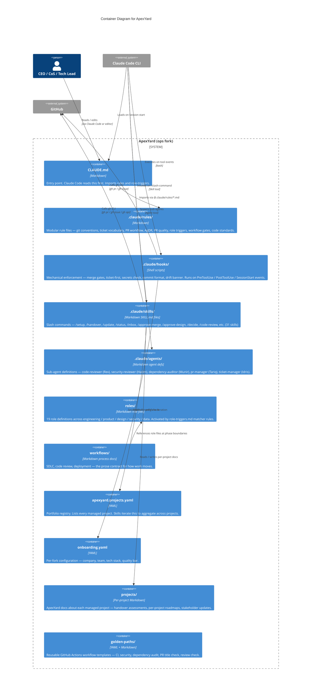

# Container Diagram — ApexYard

> **C4 Level 2** — the functional subsystems inside the ApexYard fork. Non-traditional: ApexYard has no runtime of its own. Each "container" is a folder-scoped set of files interpreted by an external system (Claude Code CLI, the user, or GitHub's rendering).

## Diagram

## How to read this

ApexYard is unusual in C4 terms: there is **no running process that IS ApexYard**. Every "container" above is a folder of files. The "runtime" is either:

- **Claude Code CLI** — reads `CLAUDE.md`, executes hooks, invokes skills, spawns sub-agents
- **The user** — reads role files, workflow docs, and the portfolio registry manually
- **GitHub** — renders Markdown in the repo view, enforces branch protection, runs CI on `golden-paths/` pipelines copied into project repos

The diagram captures which "container" does what *when interpreted by the right runtime*. It's a useful zoom level even though it diverges from the typical "containers are deployable units" framing of L2.

## Key relationships

- **CLAUDE.md → rules** is the single most important arrow. Every rule file is imported via `@.claude/rules/*.md` from `CLAUDE.md`, and Claude Code applies them. Without that import chain, rules are orphaned prose.
- **hooks → github** — hooks call `gh` directly (e.g. `block-merge-on-red-ci.sh` runs `gh pr checks`). This is how ApexYard's mechanical enforcement reaches the remote tracker state.
- **skills → github** — skills are the user-facing portfolio-aware commands. Most call `gh` at some point; some also read the registry to iterate.
- **skills → registry / projectdocs** — the portfolio-level read/write flow. `/inbox` / `/status` / `/projects` / `/stakeholder-update` all live here.

## What this diagram does NOT show

- Specific hook-to-rule mapping (which hook enforces which rule) — see `docs/rule-audit.md` for that.
- The full list of 31 skills — see CLAUDE.md § "Available skills".
- The full list of 19 roles — see `.claude/rules/role-triggers.md`.
- The user's local `workspace/<name>/` clones of managed projects — they're gitignored and sit outside the ApexYard boundary (they belong to the managed project, not to ApexYard).

## Related diagrams

- L1 system context: [`apexyard-context.md`](./apexyard-context.md)
- SDLC sequence (how a feature flows phase by phase): `workflows/sdlc.md`
- Rule audit (every MUST → hook / advisory / deferred): `docs/rule-audit.md`

## Maintenance

Updates when:

- A new top-level directory is added or removed (e.g. if `.claude/skills/` were renamed)
- A new "container" type joins the architecture (e.g. a `templates/` folder were promoted to first-class)
- The Claude Code integration model changes (new event type, new agent shape)

Skill-count / hook-count / role-count drift goes in the relevant summary docs (CLAUDE.md, hooks/README.md), not here. This diagram stays at the "shape of the fork" level.
