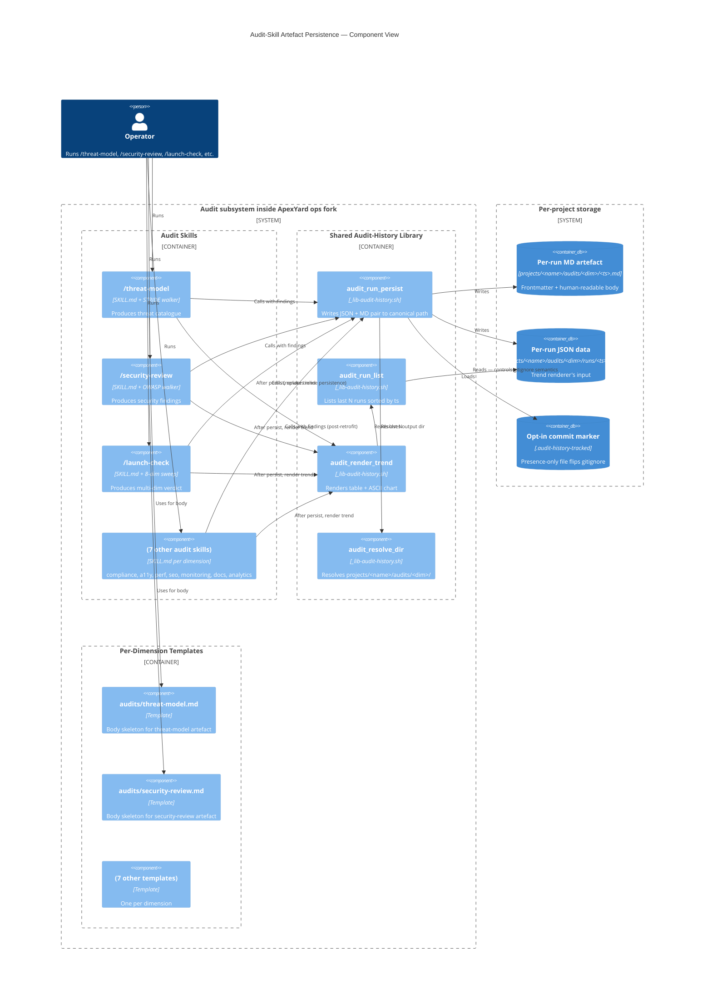
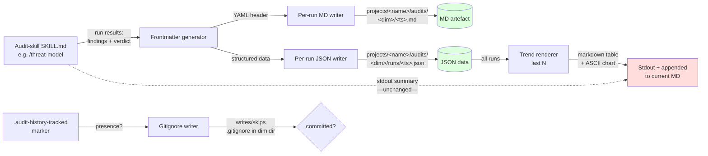

# Technical Design — Audit-Skill Artefact Persistence + Canonical Structure

**Status**: Draft
**Author**: Hisham (Tech Lead) — drafted via Claude Code session
**Date**: 2026-05-11
**Ticket**: [me2resh/apexyard#218](https://github.com/me2resh/apexyard/issues/218)
**Related AgDR**: [AgDR-0019 — Audit-skill artefact persistence schema and lib](../agdr/AgDR-0019-audit-artefact-persistence.md)
**Prior art**: [AgDR-0014 — `/launch-check` historical trend tracking](../agdr/AgDR-0014-launch-check-trend-tracking.md), `.claude/skills/launch-check/`

---

## Overview

### Summary

Generalise `/launch-check`'s existing per-run artefact convention (per-run JSON for chart data + per-run markdown for the human report + opt-in commit marker) into a shared library that the other nine audit skills (`/threat-model`, `/security-review`, `/compliance-check`, `/accessibility-audit`, `/performance-audit`, `/seo-audit`, `/monitoring-audit`, `/docs-audit`, `/analytics-audit`) consume, so every audit run produces a structurally consistent persisted artefact and the trend across runs becomes readable.

### Goals

- One shared shell library (`.claude/hooks/_lib-audit-history.sh`) handles persistence + trend rendering for all audit skills
- Consistent on-disk shape: `projects/<name>/audits/<dimension>/runs/<ts>.json` + `projects/<name>/audits/<dimension>/<ts>.md`
- Common frontmatter contract: `date`, `sha`, `dimension`, `verdict`, `findings[]` — extensible per-dimension via the markdown body
- Pilot retrofit of `/threat-model` and `/security-review`; follow-up ticket retrofits the remaining seven dimensions
- `/launch-check` refactored to consume the shared lib without behaviour change — its existing `runs/*.json` files continue to render correctly

### Non-Goals

- Migrating existing free-form audit outputs — there's no historical persisted output for the seven non-launch-check dimensions; the trend starts at the first post-feature run
- Cross-project audit aggregation (a portfolio-wide "every audit's latest verdict across all managed projects" view) — useful, but separate ticket
- Changing what each audit *checks* — purely about persistence, structure, trend rendering. Audit-content changes are out of scope
- Replacing the stdout summary that operators see in the terminal — the persisted artefact is *additional* output, not a substitute

---

## Domain Model

### Entities

```
AuditRun
├── id: <ts>                (e.g. 2026-05-11T20-30-00Z — colons replaced for FS safety)
├── dimension: AuditDimension
├── repo: { branch, commit }
├── verdict: Verdict
├── findings: Finding[]
└── Methods:
    ├── persist()            → writes JSON + MD pair
    └── render_summary()     → markdown for stdout

AuditHistory (per dimension, per project)
├── runs: AuditRun[]
├── Methods:
    ├── load_recent(n)
    ├── append(run)
    └── render_trend(n)      → markdown table + ASCII chart
```

### Value Objects

| Value Object | Fields | Purpose |
|---|---|---|
| `AuditDimension` | `name` (string, e.g. `threat-model`, `security-review`) | Identifies which audit produced the run; drives the `audits/<dimension>/` path segment |
| `Verdict` | one of `pass` / `conditional` / `fail` (alias map preserves launch-check's `go` / `go-with-warnings` / `conditional-go` / `no-go`) | Headline outcome |
| `Finding` | `id` (string), `severity` (`critical`/`high`/`medium`/`low`/`info`), `status` (`open`/`mitigated`/`accepted`), `summary` (string) | The common denominator across all dimensions; per-dimension extras live in the MD body |
| `RunTimestamp` | `value` (ISO-8601 UTC), `fs_safe()` (colons → dashes for filesystem) | Used as run id and filename |

### Why this common denominator works

Every audit emits findings with a severity and a status. The free-form context (STRIDE category for threat-model, OWASP class for security-review, WCAG criterion for accessibility) lives in the MD body — the structured frontmatter only carries what the trend renderer needs to compare runs.

---

## Architecture

### C4 Level 3 — Component Diagram



### Data Flow Diagram



The skill's stdout summary (the human-readable verdict + findings table the operator sees in the terminal) is **unchanged** — persisted artefact is additional output, not a replacement. This is the load-bearing UX promise.

---

## API Design

### Shared library — `.claude/hooks/_lib-audit-history.sh`

Sourced by audit skills via:

```bash
source "$(git rev-parse --show-toplevel)/.claude/hooks/_lib-audit-history.sh"
```

Exposes four shell functions. Each is a thin shell wrapper — no heavy logic, easily testable.

| Function | Signature | Purpose |
|---|---|---|
| `audit_resolve_dir <project_name> <dimension>` | echoes path | Resolves `<projects_dir>/<project_name>/audits/<dimension>/` via `portfolio_projects_dir`. Creates the dir if missing. |
| `audit_run_persist <project_name> <dimension> <ts> <verdict> <json_payload> <md_body>` | exit 0 / 1 | Writes both the JSON file (under `runs/`) and the MD file (frontmatter generated from `<verdict>` + `<ts>` + `<dimension>` + `<json_payload>`'s `findings` array, body = `<md_body>`). Updates `.gitignore` semantics based on `.audit-history-tracked` marker. |
| `audit_run_list <project_name> <dimension> [limit]` | prints filenames sorted by ts desc | Used by trend renderer + adopters writing custom dashboards. Limit defaults to 10. |
| `audit_render_trend <project_name> <dimension> [n]` | prints markdown trend block to stdout | Loads last N JSON files, sorts by ts, emits the trend section (heading + table + ASCII chart). Silent when < 2 runs. Calls into existing `render-trend.sh` logic, generalised for dimension. |

### Per-run JSON schema

```json
{
  "schema_version": 1,
  "ts": "2026-05-11T20:30:00Z",
  "dimension": "threat-model",
  "branch": "main",
  "commit": "abc1234",
  "verdict": "fail",
  "findings": [
    {
      "id": "T1",
      "severity": "high",
      "status": "open",
      "summary": "No rate limit on /auth/login"
    }
  ],
  "stats": {
    "by_severity": { "critical": 0, "high": 3, "medium": 5, "low": 2 },
    "by_status":   { "open": 8, "mitigated": 1, "accepted": 1 }
  }
}
```

`stats` is derived from `findings` at write time (saves the trend renderer from re-aggregating on every read). `schema_version` is the explicit version field — bumped on breaking schema changes; renderer reads any version it knows.

### Per-run MD frontmatter

```markdown
---
date: 2026-05-11
sha: abc1234
dimension: threat-model
verdict: fail
schema_version: 1
findings_summary:
  critical: 0
  high: 3
  medium: 5
  low: 2
---

# Threat Model — <project> @ abc1234

(human-readable body, including the per-dimension specifics that don't fit the
generic `findings[]` shape — e.g. STRIDE category groupings for threat-model,
WCAG criterion mappings for a11y. Each dimension's template at
`templates/audits/<dim>.md` provides the body skeleton.)
```

The frontmatter has the load-bearing structured fields; the body is freeform per dimension.

---

## Data Model

### Storage layout

```
projects/<name>/audits/
├── threat-model/
│   ├── 2026-05-11T20-30-00Z.md         ← per-run MD (the durable artefact)
│   ├── 2026-04-15T14-22-00Z.md
│   ├── runs/
│   │   ├── 2026-05-11T20-30-00Z.json   ← per-run JSON (trend renderer input)
│   │   └── 2026-04-15T14-22-00Z.json
│   ├── .gitignore                       ← per-dim, written by lib based on marker presence
│   └── .audit-history-tracked           ← presence-only opt-in marker (per-dim)
├── security-review/
│   └── (same shape)
└── launch-check/                        ← post-refactor; existing data preserved
    ├── 2026-05-08T19-30-00Z.md          ← already exists, unchanged
    └── runs/
        └── 2026-05-08T19-30-00Z.json    ← already exists, unchanged
```

The opt-in commit marker is **per-dimension** — adopters might want trend history archived for security audits but not for accessibility. `.audit-history-tracked` lives next to the dimension's runs, not at the project root.

### Backward compatibility with `/launch-check`

`/launch-check` currently writes to `projects/<name>/launch-check/` (no `audits/` segment) and uses different scoring (`scores{}` map of 8 dimensions, not generic `findings[]`). The refactor:

1. **Path migration** — write new artefacts to `projects/<name>/audits/launch-check/` going forward; leave existing `projects/<name>/launch-check/` files where they are. The trend reader looks at both paths and merges chronologically. Operators can manually `mv` the old dir under `audits/` if they want a single tree.
2. **Schema mapping** — the existing `scores{}` map maps cleanly onto the generic shape via a per-launch-check adapter: each scored dimension becomes a `Finding` with `severity` derived from score (≥85 = info, 70-84 = low, 55-69 = medium, 40-54 = high, <40 = critical) and `status` always `open`. The original `scores{}` is preserved in the JSON for the trend chart's score-axis rendering.
3. **Verdict alias** — `go` / `go-with-warnings` / `conditional-go` / `no-go` map to `pass` / `pass` / `conditional` / `fail` for the generic frontmatter; the launch-check skill's own output continues to use the four-state vocabulary in its body.

---

## Implementation Plan

### Tasks

| # | Task | Estimate | Dependencies |
|---|---|---|---|
| 1 | Write `.claude/hooks/_lib-audit-history.sh` (4 functions, ~150 LOC bash) | 3h | — |
| 2 | Write `.claude/hooks/tests/test_audit_history.sh` (write/read/trend/marker) | 2h | 1 |
| 3 | Write canonical templates: `templates/audits/threat-model.md`, `templates/audits/security-review.md` | 1h | — |
| 4 | Retrofit `/threat-model` SKILL — Step 3 calls lib for persistence + appends trend | 1h | 1, 3 |
| 5 | Retrofit `/security-review` SKILL — same shape | 1h | 1, 3 |
| 6 | Refactor `/launch-check` to consume the shared lib (preserves existing JSON path + adds new MD path) | 2h | 1 |
| 7 | Regression test: run `/launch-check` against an existing run history, confirm trend output unchanged | 1h | 6 |
| 8 | Write follow-up ticket for the remaining 7 audit skills' retrofit | 0.5h | — |

**Total estimate:** ~11h. Single PR — the lib + pilot retrofit + launch-check refactor ship together so nothing references a half-built API.

---

## Risks & Mitigations

| Risk | Likelihood | Impact | Mitigation |
|---|---|---|---|
| `/launch-check` refactor breaks existing trend rendering | Medium | High | Task 7 is a regression test against the live history store. Lib-internal — no behaviour change visible to operators. If broken, revert is one commit. |
| Findings shape too rigid → squeezes per-dimension nuance into a generic frame that loses meaning | Medium | Medium | Frontmatter only carries the trend-renderer needs (`severity`, `status`); dimension-specific structure lives in the MD body via per-dim templates. AgDR-0019 records this trade-off. |
| Adopters' existing `/launch-check` history gets orphaned by path change | Low | Medium | Reader merges old + new paths chronologically. Migration is opt-in (`mv` the old dir manually if you want one tree). No silent destruction. |
| Bash-detection in `_lib-detect-bash-write.sh` flags lib's own writes during testing → blocks tests | Low | Low | Tests run from `bootstrap_skills` exemption context. Pattern proven in launch-check's existing tests. |
| Schema bump (v1 → v2) breaks adopters mid-flight | Low | Medium | `schema_version` field is explicit; renderer dispatches per version and falls back to v1 reader for older files. v2 is N-quarters away. |

---

## Security Considerations

- [x] No secrets in artefacts — frontmatter and body are operator-readable text only
- [x] Path resolution via `portfolio_projects_dir` — same boundary the rest of the framework uses; no new attack surface
- [x] Opt-in commit marker is presence-only — no parsable content, no injection vector
- [x] No external network calls — purely local file I/O
- [x] No PII in audit artefacts (audits are about *the codebase*, not about users)

---

## Testing Strategy

| Type | Coverage | Notes |
|---|---|---|
| Bash unit tests | All four lib functions | `test_audit_history.sh` mirrors `test_launch_check_trend.sh` pattern. Mocks `gh` for project resolution. |
| Integration | `/threat-model` end-to-end: invoke skill → confirm artefacts written → confirm trend rendered on second run | Manual smoke during PR; no live tracker dependency |
| Regression | `/launch-check` post-refactor against fixture history of 5 runs → trend output byte-equal to pre-refactor baseline | Snapshot test |

---

## Open Questions

| Question | Owner | Status |
|---|---|---|
| Should `audit_run_persist` accept `findings[]` as JSON-on-stdin or as a temp-file path? Bash quoting on multi-line JSON via argv is fiddly. | Hisham | Open — leaning stdin for clean quoting |
| For `/launch-check`'s post-refactor MD artefact, is the `findings_summary.{critical,high,...}` count driven from the score-derived severity mapping above, or do we leave launch-check's frontmatter score-shaped instead? | Hisham + Khalid | Open — favouring score-shaped (preserves what the trend chart already plots) |
| Should the per-dimension templates at `templates/audits/<dim>.md` be auto-loaded by the skill, or does each skill embed its own body inline? Auto-load is DRY but couples the skill to a template path that may move. | Hisham | Open — small enough that either works; lean toward inline body, template is just reference |

---

## Approvals

| Role | Name | Date | Status |
|---|---|---|---|
| Tech Lead | Hisham (drafter) | 2026-05-11 | Author |
| Head of Engineering | Khalid | | Pending — requested for the launch-check backward-compat call |
| Security | Faisal (Head of Security) | | Skip — no security surface added |
