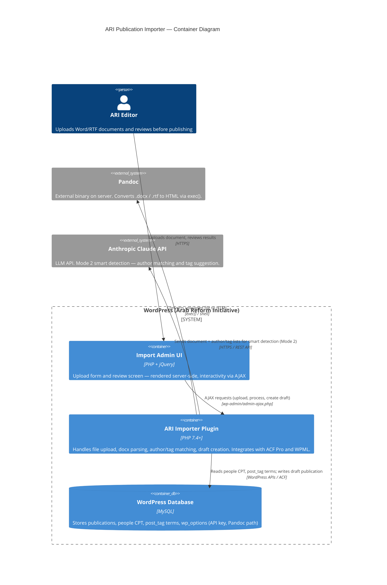

# ARI Publication Importer — C4 Level 2 (Container Diagram)

> **Note**: this diagram was auto-generated by /handover on 2026-04-28 from repo signals (plugin file structure, class files, CHANGELOG). It is a **starting point** — review and refine.
>
> - Container labels and tech strings — the detector may have picked a framework version wrong
> - Inferred relationships — Editor → WordPress Admin assumes HTTPS; adjust if your stack uses something else
> - External systems — anything your team uses that isn't in PHP files (e.g. CDN, S3) won't have been detected
>
> Update the "Maintenance" section below once the diagram is stable.

## Maintenance

(Handover-generated — update when containers change, e.g. if Pandoc is replaced with a PHP library, or if the plugin is split into separate services.)
